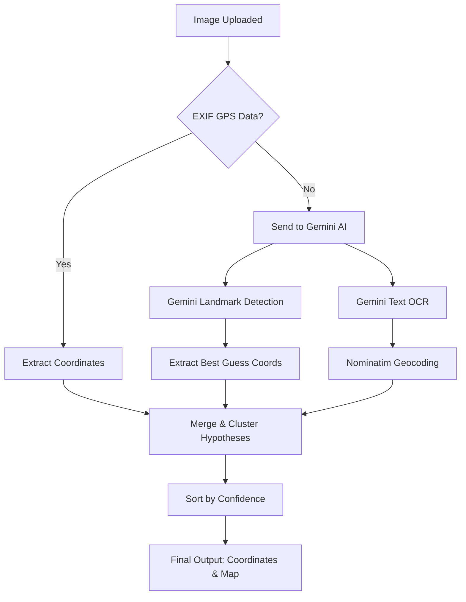

# 🌍 Photo Geolocation Service

[](https://www.python.org/)
[](https://fastapi.tiangolo.com/)
[](https://www.postgresql.org/)
[](https://redis.io/)
[](https://www.docker.com/)

A modern, high-performance **photo geolocation service** that automatically determines the geographic coordinates of images. It extracts metadata (EXIF GPS), leverages **Gemini AI Vision** for landmark and OCR detection, and queries open geocoding APIs (OpenStreetMap Nominatim) to deliver highly accurate, confidence-ranked location hypotheses.

---

## ✨ Features

### 🎯 Core Capabilities
* **EXIF GPS Metadata Extraction**: Instantly parses and reads exact embedded GPS coordinates from JPEG/TIFF images.
* **AI Landmark Recognition**: Utilizes Gemini Vision API (`gemini-flash-latest`) to visually recognize landmarks, historical sites, and monuments.
* **OCR Geocoding**: Extracts readable text from signs, banners, and street names, then processes it through geocoding services.
* **Multi-Provider Geocoding**: Seamlessly resolves locations using OpenStreetMap (Nominatim), with optional support for LocationIQ and OpenCage.
* **Intelligent Ranking**: Groups, ranks, and weights hypotheses from different sources using an advanced confidence-based clustering algorithm.
* **Batch Processing**: Supports uploading and processing multiple images in parallel.

### 🛠 Tech Stack
* **Framework**: FastAPI (Async Python)
* **AI/Vision**: Gemini API (`google-generativeai`), Pillow
* **Geocoding**: Geopy, Nominatim API
* **Database**: PostgreSQL / SQLite (with SQLAlchemy ORM + Alembic migrations)
* **Caching**: Redis
* **Task Queue**: Celery (for background tasks)
* **Frontend**: HTML5, Vanilla CSS, Leaflet.js (for map rendering)

---

## 🚀 Quick Start

### 1. Requirements
* Python 3.11+
* SQLite (local dev default) or PostgreSQL
* Optional: Redis (for caching)

### 2. Installation
```bash
# Clone the repository
git clone <repository-url>
cd Photo_geolocation

# Create a virtual environment and install dependencies
make install
```

### 3. Configuration
Copy the template `.env` file and configure it:
```bash
cp .env.example .env
```
Open `.env` and add your **Gemini API Key**:
```env
# Get a free API key at: https://aistudio.google.com/app/apikey
GEMINI_API_KEY=your_gemini_api_key_here
```

### 4. Running the App
Run the development server:
```bash
make dev
```
Open your browser and navigate to **[http://localhost:8000/demo](http://localhost:8000/demo)** to access the web interface.

---

## 📷 How It Works (Example Run)

Below is an illustration of how the application processes an image step-by-step:

### Input Photo
A user uploads an image containing a famous bridge (e.g., Lomonosov Bridge in Saint Petersburg).


### Processing Pipeline


### Response Output
The service consolidates and returns the results in a structured JSON schema:

```json
{
  "success": true,
  "request_id": "8b9e67ca-901d-400b-bdfe-3e913aef19cd",
  "best_guess": {
    "latitude": 59.92886,
    "longitude": 30.33441,
    "confidence": 1.0,
    "source": "landmark_detection",
    "landmark_name": "Lomonosov Bridge",
    "description": "Landmark: Lomonosov Bridge",
    "address": "Lomonosov Bridge, Fontanka River Embankment, Saint Petersburg, Northwest Federal District, 191023, Russia"
  },
  "hypotheses": [
    {
      "latitude": 59.92886,
      "longitude": 30.33441,
      "confidence": 1.0,
      "source": "landmark_detection",
      "landmark_name": "Lomonosov Bridge",
      "address": "Lomonosov Bridge, Fontanka River Embankment, Saint Petersburg, Northwest Federal District, 191023, Russia"
    }
  ]
}
```

---

## 📡 API Endpoints

| Method | Endpoint | Description |
| :--- | :--- | :--- |
| **GET** | `/health` | Application status & service availability metrics |
| **GET** | `/demo` | Renders the Leaflet.js interactive web frontend |
| **POST** | `/upload` | Process a single photo (Returns coordinates + metadata) |
| **POST** | `/upload/batch` | Upload and process multiple images in parallel |

---

## 🧪 Testing & Code Quality

Running unit and integration tests:
```bash
make test
```

Formatting and linting:
```bash
make format   # runs black & isort
make lint     # runs flake8 & mypy
```

---

## 📄 License
This project is licensed under the MIT License - see the [LICENSE](LICENSE) file for details.
